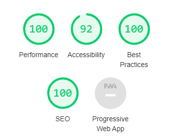

# QA-Bank

A tool where you can ask question and you will get the answer instantly.


## Screenshots


## Tech Stack

**Client:** React, NextJS, Apollo-Client

**Server:** NextJS Server ( Public API : https://m3o.com/answer)

    1. Cache based request and response in apollo client (In Memory cache)
    2. Rest-Link in apollo client to make requests to a REST Server
    3. Internationalized routing with NextJS ( Without external library)
    4. SSR and CSR both based on client requirements.
    5. When query params come in, The page is generated on server.
    6. CSR for quick response to user when question is typed.
    7. Modular CSS
    8. Added locales custom text only for static content.
    9. Totally responsive with Hamburger menu.

The reason I love NextJS :



## Installation
Make sure you have nodejs, NPM, git installed in your computer. Google it based on your OS. 

To Install the project :

1.

```bash
  git clone https://github.com/sidv1905/Question-m3o-nextJS.git

  cd Question-m3o-nextJS


```

2.

```bash

  npm install

  npm run dev

```

3. Add Env file as shared in root project

## Environment Variables

To run this project, you will need to add the following environment variables to your .env file

`NEXT_PUBLIC_TOKEN` (You can get this from https://m3o.com/answer or I can share the same)

Add the .env.local file in project root (Make a file .env.local add the NEXT_PUBLIC_TOKEN = ADD_TOKE_HERE and save it in the project root).
Project root stands for (inside Question-m3o-nextJS Folder)

## Authors

- [@sidv1905](https://www.github.com/sidv1905)

## Feedback

If you have any feedback, please reach out to me at sidvarangaonkar1905@gmail.com

## 🚀 About Me

I'm a full stack developer based in India, Spending majority of time with NextJS, React, Javascript and Python...

Connect with me on [linkedin](https://www.linkedin.com/in/siddharth-varangaonkar-9b4a3a150/)

## Acknowledgements

- Jurata team
